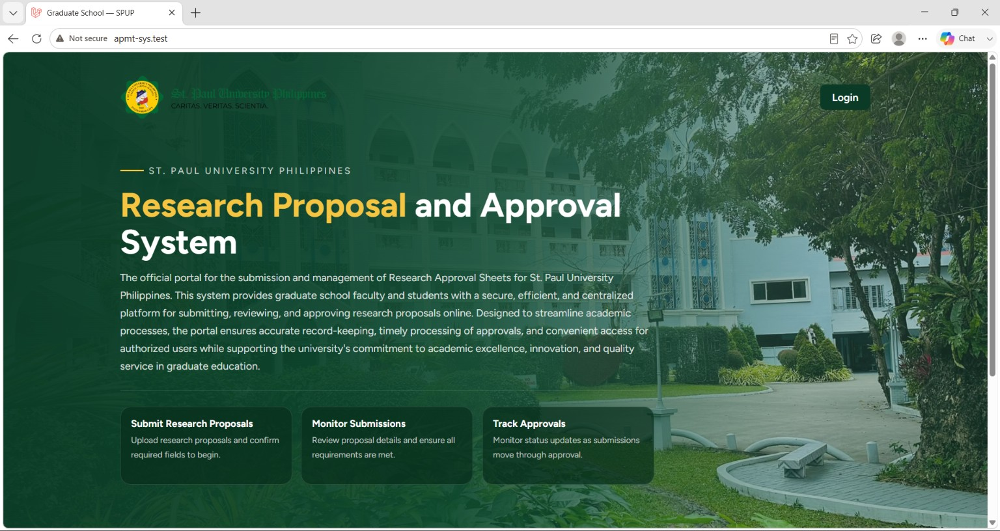
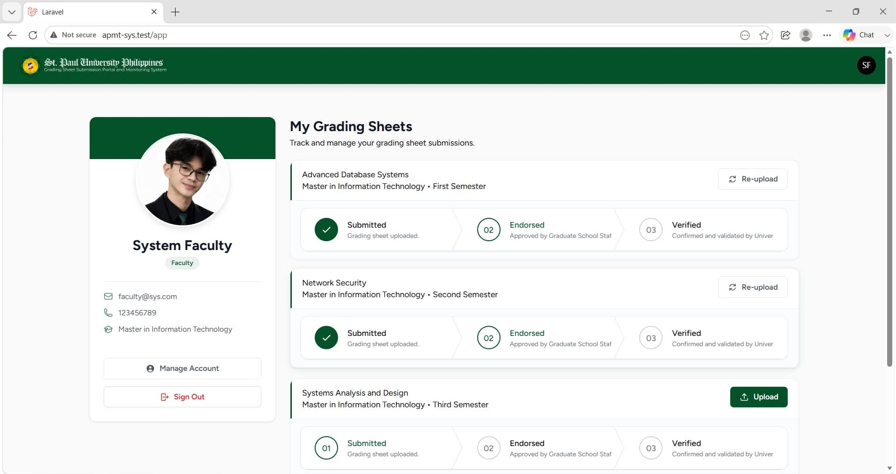
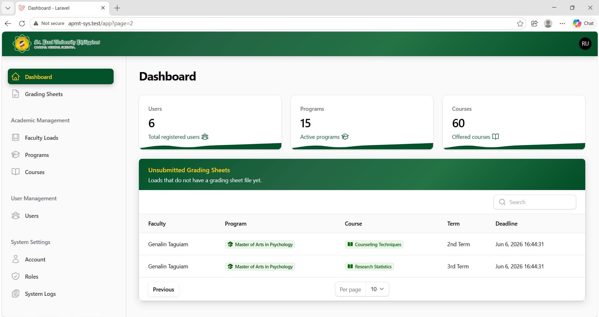
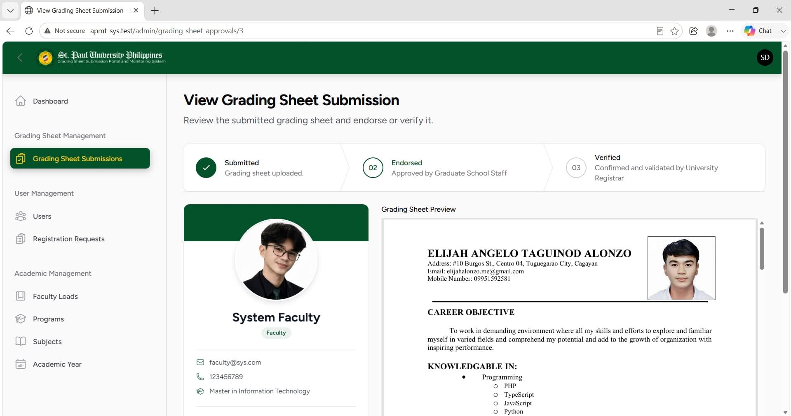

    

A freelance project developed to streamline the research proposal submission and approval process by replacing manual and in-person procedures with an online platform. The system provides a centralized workflow for submitting, reviewing, and tracking research proposals, allowing users to monitor document progress while giving reviewers an organized way to evaluate and manage submissions.

### Proposal Tracking
The Proposal Tracking section allows users to monitor the progress of their submitted research proposals. Each proposal is presented as a card with checkboxes representing the different stages of the review and approval process, allowing users to easily determine the current status of their documents without needing to manually follow up with reviewers.

### Reviewers' Dashboard
The Reviewer Dashboard provides reviewers with a centralized view of submitted research proposals that require their attention. It helps organize pending reviews and allows reviewers to efficiently monitor proposals throughout the approval process.

### Proposal Review
The Proposal Review section provides reviewers with the information and documents needed to evaluate a submitted research proposal. The submitter's personal information is displayed alongside a preview of the submitted document, allowing reviewers to verify the submission details and review the proposal within the same interface.

